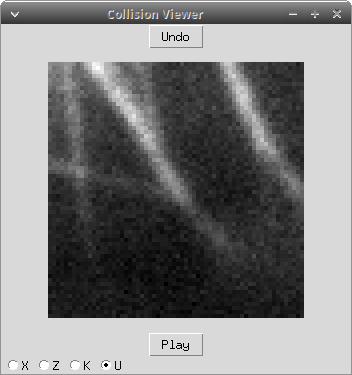

# TubuleGuess
Small Tkinter GUI for annotating movies of Microtubule collisions.

The project requires:

1. tkinter
2. tkVideoPlayer
3. pandas 
4. glob

As it is right now, the script search for all the movies (mp4 files) in the current directory  folders (the cells folders) and all its subfolders (all the events for a particular cell). Then loads a viewer which allows to choose the event in the current movie (K,X,U,Z). Once this is done it saves the results and jumps to a new movie.

The script is called Mtplayer.py. And it should look like the image below.

